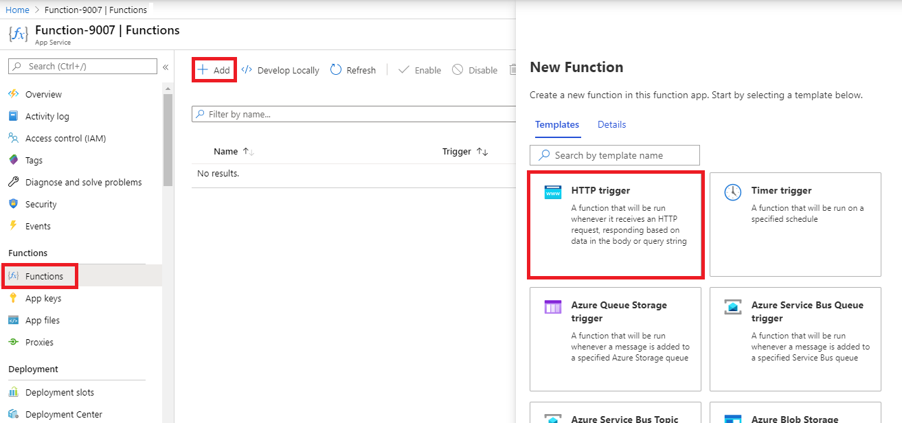
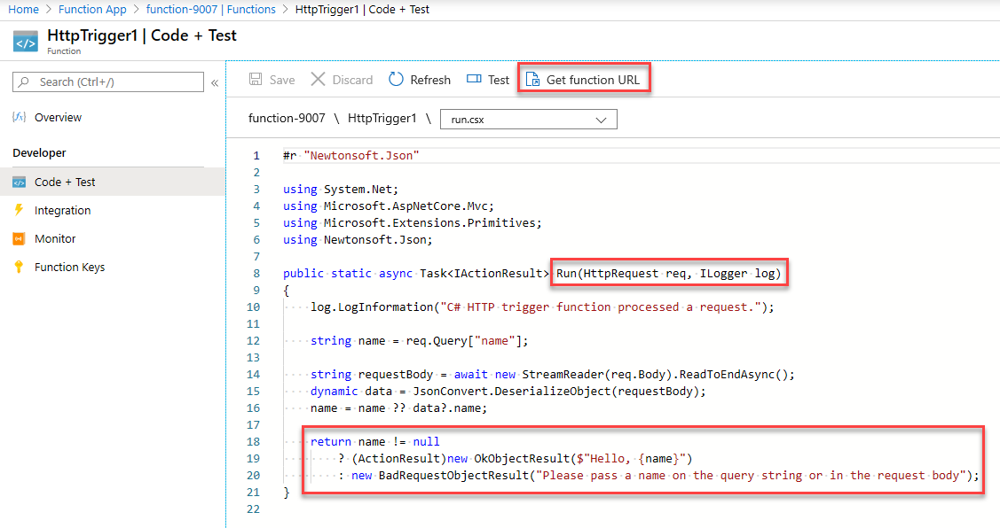
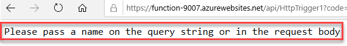
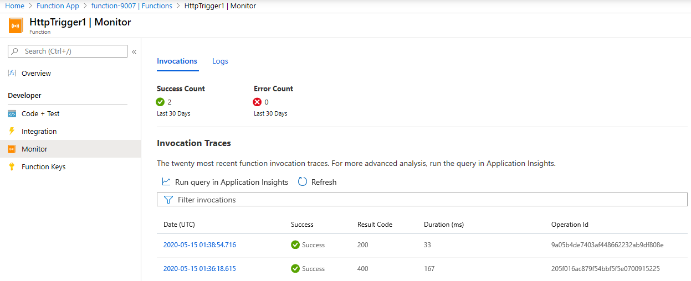

---
wts:
    title: '08 - Implement Azure Functions'
    module: 'Module 03: Describe core solutions and management tools'
---
# 08 - Implement Azure Functions

In this walkthrough, we will create a Function App to display a Hello message when there is an HTTP request. 

# Task 1: Create a Function app

In this task, we will create a Function app.

1. Sign in to the [Azure portal](https://portal.azure.com).

1. In the **Search resources, services, and docs** text box at the top of the portal, search for and select **Function App** and then, from the **Function App** blade, click **+ Add**.

1. On the **Basic** tab of the **Function App** blade, specify the following settings (replace **xxxx** in the name of the function with letters and digits such that the name is globally unique and leave all other settings with their default values): 

    | Settings | Value |
    | -- | --|
    | Subscription | the name of your Azure subscription |
    | Resource group | the name of a new resource group **myRGFunction** |
    | Function App name | **function-xxxx** |
    | Publish | **Code** |
    | Runtime stack | **.NET Core** |
    | Region | **East US** |
    | | |	

1. Click **Review + Create** and, after successful validation, click **Create** to begin provisioning and deploying your new Azure Function App.

1. Wait for the notification that the resource has been created.

1. Navigate back to the **Function App** blade, click **Refresh** and verify that the newly created function app has the **Running** status. 

    

# Task 2: Create a HTTP triggered function and test

In this task, we will use the Webhook + API function to display a message when there is an HTTP request. 

1. On the **Function App** blade, click the newly created function app. 

1. On the function app blade, in the **Functions** section, click **Functions** and then click **+ Add**.

    

1. On the **Templates** tab of the **New Function** blade, click **HTTP trigger**. 

    

1. On the **Details** tab of the **New Function** blade, accept the default **New Function** name and **Authorization level**, and then click **Create Function**. 

    

1. On the **HttpTrigger1** blade, in the **Developer** section, click **Code + Test**. 

1. On the **HttpTrigger1 \| Code + Test** blade, review the auto-generated code and note that the code is designed to run an HTTP request and log information. Also, notice the function returns a Hello message with a name. 

    

1. Click **Get function URL** from the top section of function editor. 

1. Ensure that the value in the **Key** drop-down list is set to **default** and click **Copy** to copy the function URL. 

    

1. Open a new browser tab and paste the copied function URL into your web browser's address bar. When the page is requested the function will run. Notice the returned message stating that the function requires a name in the request body.

    

1. Append **&name=*yourname*** to the end of the URL.

    **Note**: Replace ***yourname*** with your first name. For example, if your name is Cindy, the final URL will resemble the following `https://azfuncxxx.azurewebsites.net/api/HttpTrigger1?code=X9xx9999xXXXXX9x9xxxXX==&name=cindy`

    

1. When your function runs, every invocation is traced. To view the traces in Azure portal, return to the **HttpTrigger1 \| Code + Test** blade and click **Monitor**.

     

Congratulations! You have created a Function App to display a Hello message when there is an HTTP request. 

**Note**: To avoid additional costs, you can remove this resource group. Search for resource groups, click your resource group, and then click **Delete resource group**. Verify the name of the resource group and then click **Delete**. Monitor the **Notifications** to see how the delete is proceeding.
